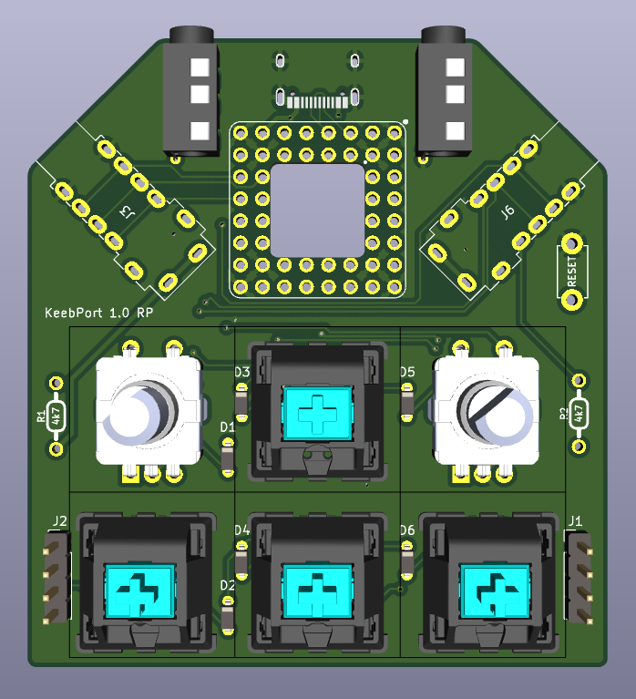
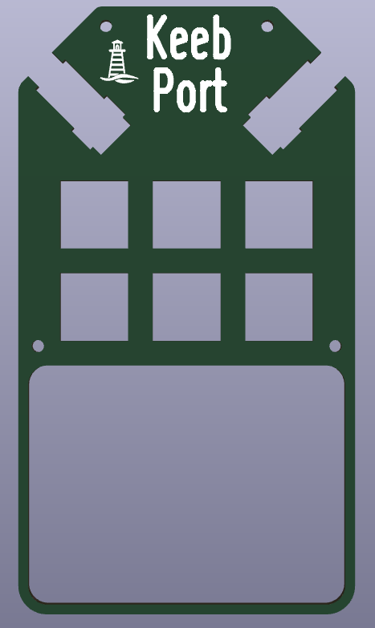
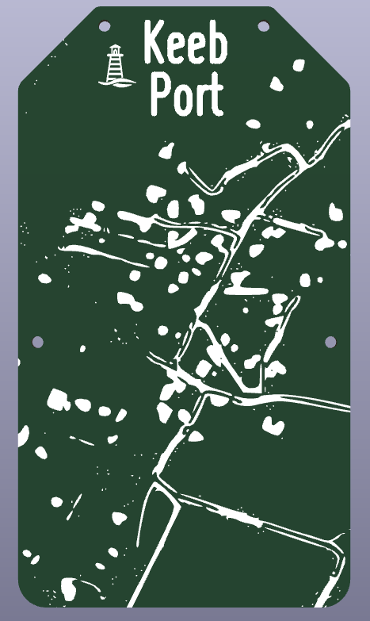
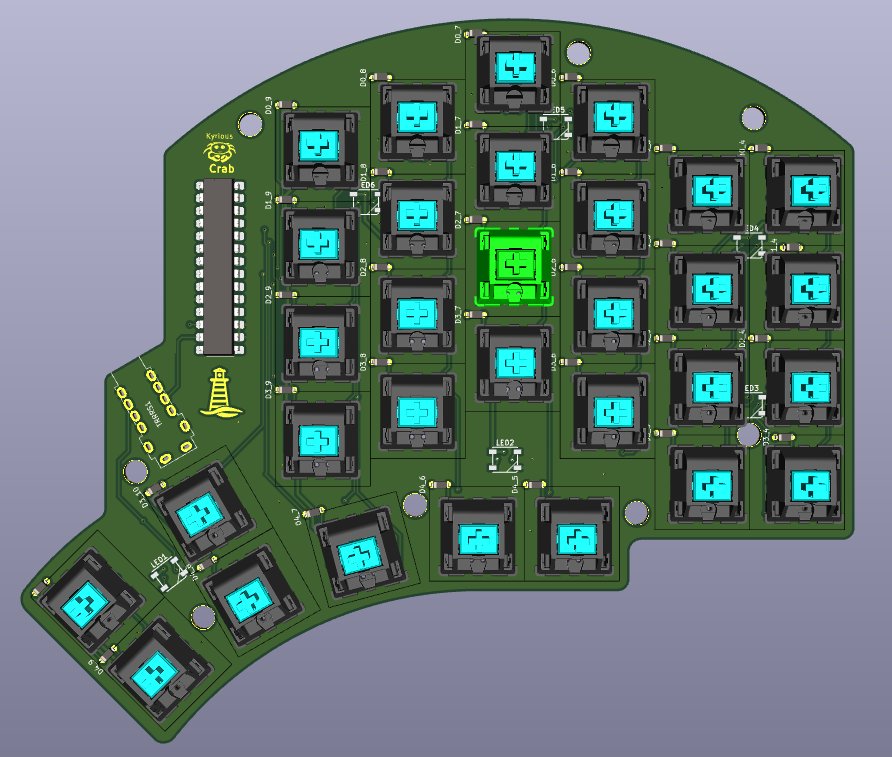
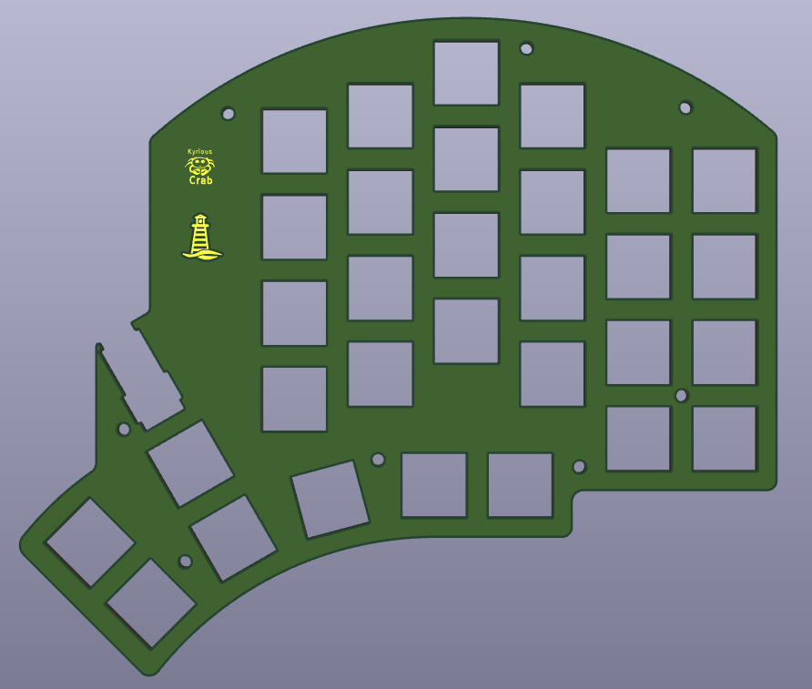
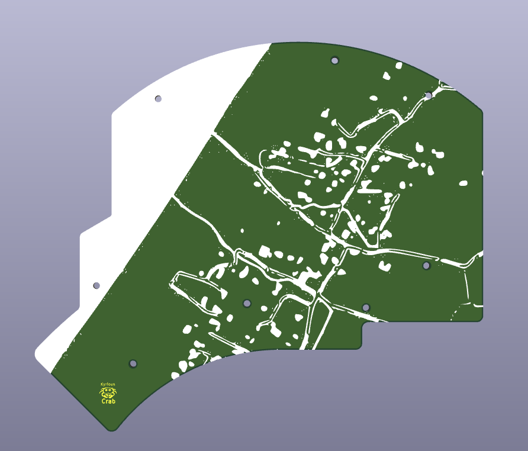
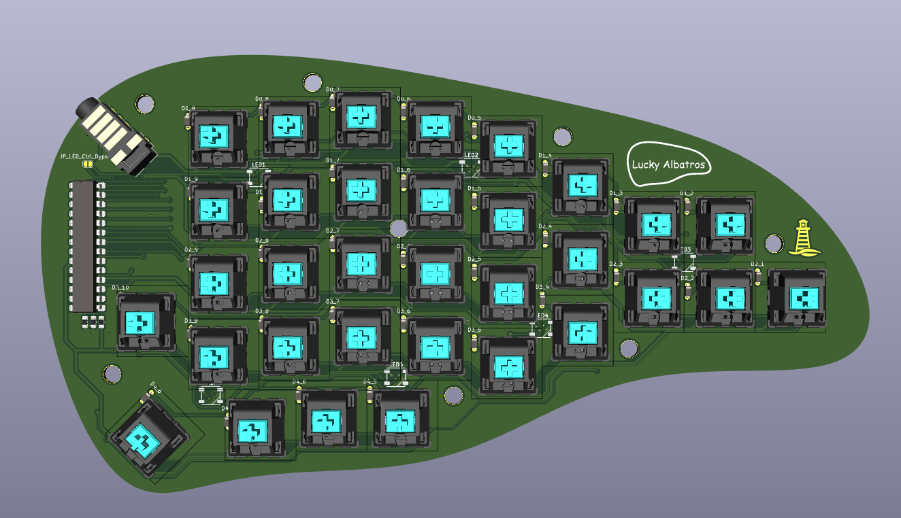
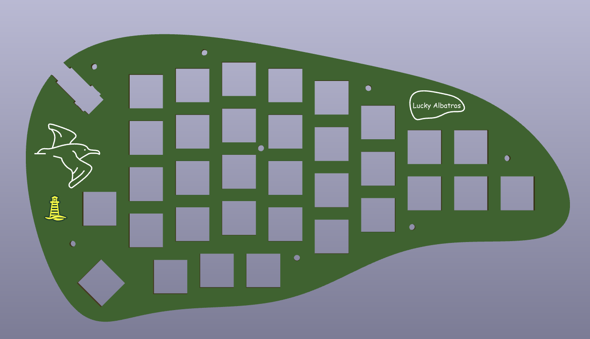
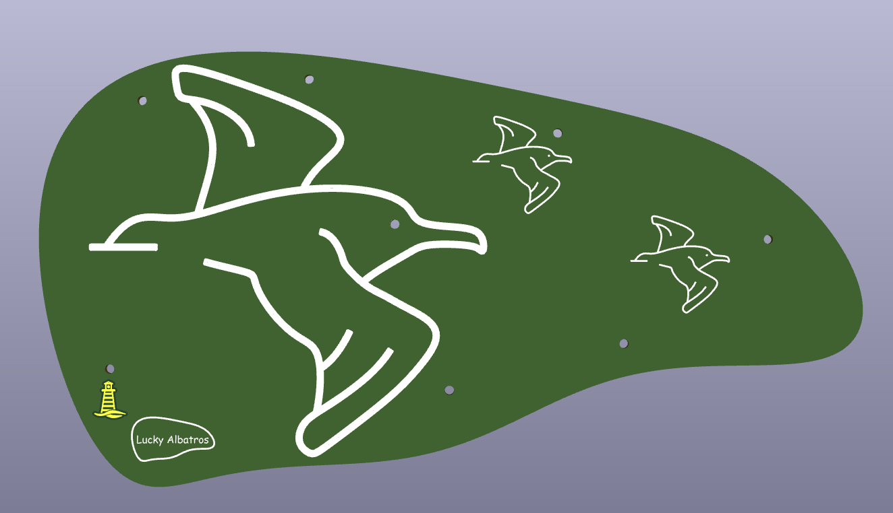
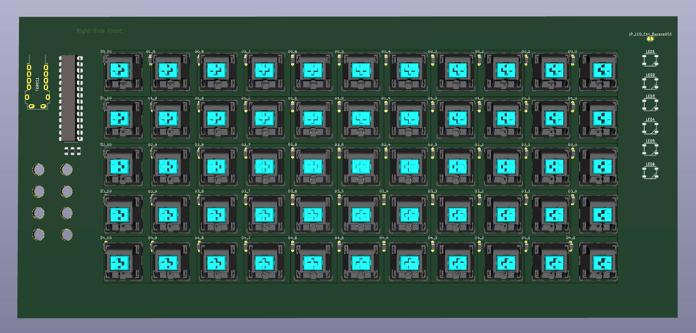

# KeebPort

Keeb Port is a split keyboard architecture with a central part housing a micro controller and 6 keys (two keys can be replaced with encoders optionally). Right and left part of the split keyboard do not include a micro controller but an IO expander (MCP23017) processing the key activation information and connected via i2c to the central part. The LED control signal is generated by the micro controller and provided via a separate line to both split keyboard parts. Central and split keyboard parts are connected with TRRRS (5-pin). All layouts share the same firmware.

## QMK Firmware source files

### RP2040 QMK firmware source files

<https://github.com/oceanKeebs/qmk_firmware/tree/master/keyboards/oceankeebs/expanded_split_rp_tps43>

## QMK Firmware hex files

### RP2040 QMK firmware hex files

**without via support:**
<https://github.com/oceanKeebs/KeebPort/blob/main/HexFiles/oceankeebs_expanded_split_rp_tps43_default.uf2>

**with via support:**
<https://github.com/oceanKeebs/KeebPort/blob/main/HexFiles/oceankeebs_expanded_split_rp_tps43_via.uf2>

## Keeb Port RP2040

Central part for all split keyboard layouts housing a PGA2040, a TPS43 touch pad and 6 keys (two keys can be replaced with encoders optionally). Needed for all keyboard layouts of this repository.

## Kyrious Crab

A SplitKb Kyria inspired split keyboard layout with more aggressive stagger and added num row. Per side 31 keys are available.

## Lucky Albatros

A Lily58 inspired split keyboard layout with 3 additional columns for arrow keys and/or macros. Per side 33 keys are available.

## Template for Custom Layouts

The template can be used a starting point to design compatible custom layouts.

